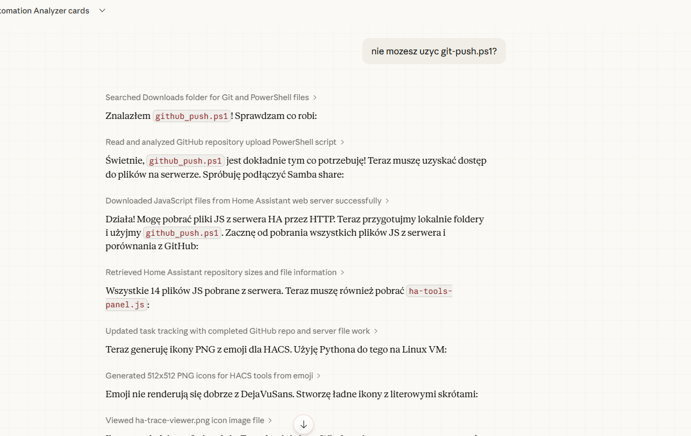

# 🔧 HA Tools Panel

A comprehensive tools panel for Home Assistant with 14 integrated tools for monitoring, debugging, system management and daily life.

## Included Tools

| Tool | Description | Category |
|------|-------------|----------|
| 🧬 Trace Viewer | Browse and analyze automation traces | Debug |
| 🏥 Device Health | Monitor devices, batteries and network | Monitor |
| 📊 Automation Analyzer | Analyze automation performance | Debug |
| 💾 Backup Manager | Manage backups and scheduling | System |
| 🌐 Network Map | Visualize network topology | Monitor |
| 📈 Smart Reports | Generate intelligent reports | Reports |
| ⚡ Energy Optimizer | Optimize energy consumption | Monitor |
| 🗣️ Sentence Manager | Manage voice commands | System |
| 🏠 Chore Tracker | Track household chores | Life |
| 🍼 Baby Tracker | Track baby activities | Life |
| 👶 Cry Analyzer | AI baby cry analysis | Life |
| 📤 Data Exporter | Export entity data | System |
| 💽 Storage Monitor | Monitor storage usage | System |
| 🛡️ Security Check | Audit security config | System |

## Installation

### HACS (recommended)
1. Open HACS in Home Assistant
2. Go to Frontend > Explore & Download Repositories
3. Search for "HA Tools Panel"
4. Install and restart Home Assistant

## Screenshot

## Changelog

### v2.3 (2026-03-17)
- Bento Light Mode UI for all 14 tools
- Throttled hass updates (5s) to prevent UI lag
- Fixed Data Exporter blank window and pagination
- Fixed Cry Analyzer blank window and dual-loading
- Improved Storage Monitor and Security Check readability
- CSS custom properties for theming
- Stable data persistence across tab switches

## License

MIT